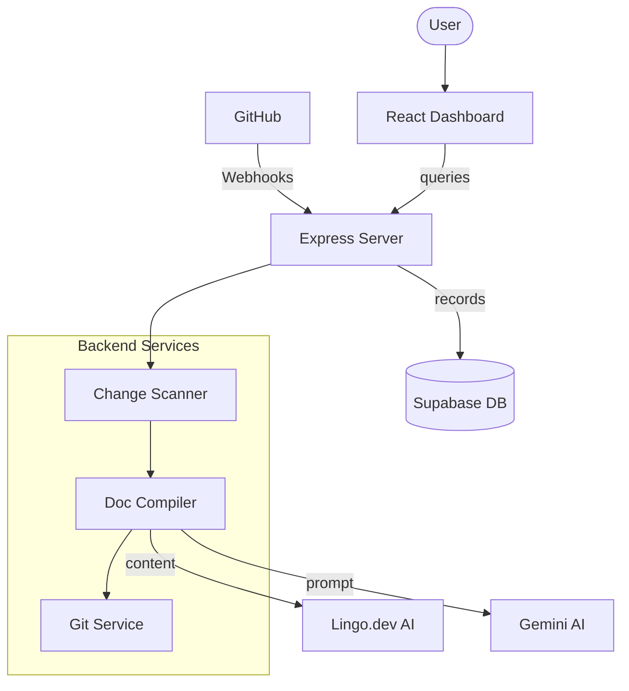

# PolyDocs Architecture

PolyDocs is a sophisticated documentation synchronization and localization platform. This document outlines the system architecture, component interactions, and data flow.

---

## 🏗️ System Overview

PolyDocs operates as a monorepo consisting of a React-based frontend and an Express-based backend. It integrates with GitHub Webhooks to detect code changes and uses AI (Gemini) and specialized localization engines (Lingo.dev) to generate and translate documentation.

### High-Level Architecture

---

## 🔄 Data Flow: The Documentation Lifecycle

The primary workflow follows these steps when a user pushes code to a monitored repository:

1.  **Ingestion**: GitHub sends a `push` event to the PolyDocs Webhook endpoint.
2.  **Detection**: The `Scanner` service identifies which files were modified.
3.  **Generation**:
    - Modified code is sent to **Gemini AI** to generate a comprehensive `POLYDOCS.md` file in English.
    - The English documentation is then passed to the **Lingo.dev Engine**.
4.  **Localization**: Lingo.dev translates the documentation into target locales (Spanish, French, Japanese) in parallel.
5.  **Persistence**: The generated documents are stored in **Supabase** for the Dashboard viewer.
6.  **Delivery**: The `Git` service creates a new branch, commits the docs, and opens a **Pull Request** back to the repository.

---

## 🛠️ Core Components

### 1. Frontend (Vite + React)

- **Dashboard**: Real-time monitoring of builds and PR statuses.
- **Docs Viewer**: A high-fidelity markdown renderer that pulls localized documentation directly from Supabase.
- **Auth**: Integrated with GitHub OAuth via Supabase Auth.

### 2. Backend (Node.js + Express)

- **Webhook Intake**: Validates signatures and queues build jobs.
- **Doc Compiler**: The orchestration layer for AI and localization.
- **Git Automation**: Handles temporary clones, commits, and GitHub PR creation using Octokit.

### 3. Storage Layer (Supabase)

- **PostgreSQL**: Stores repository mappings, build history, and document content.
- **RLS Policies**: Ensures users can only see their own repository data.

---

## 🛡️ Security & Scalability

- **Environment Aware**: All URLs and endpoints are externalized via `.env`.
- **Containerized**: Fully orchestrated with Docker Compose for consistent deployment.
- **Centralized Errors**: Robust middleware for consistent error reporting and logging.
- **Non-Root Execution**: Backend services run as unprivileged users inside Docker for enhanced security.

---

  
<b>PolyDocs V1.0</b> • 2026

  
Engineered for the Global Developer Ecosystem

