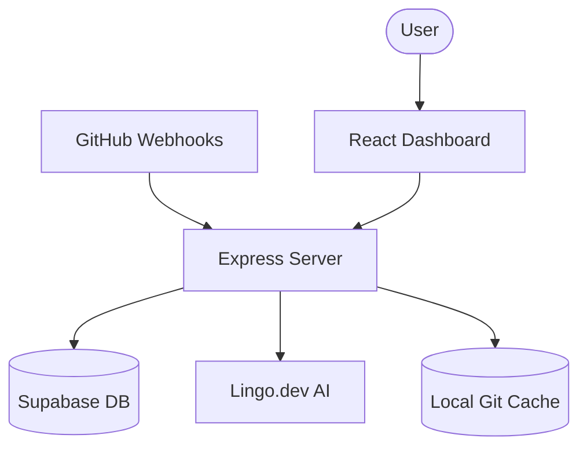

# PolyDocs: Global Documentation Auto-Sync Platform

PolyDocs is an automated system that keeps your documentation synchronized with your codebase and localizes it into multiple languages using Lingo.dev.

## Features

- **Code Change Scanner:** Automatically detects modified source files in the repository.

## Project Structure



- `backend/`: Node.js + Express + TypeScript server.
  - `src/middleware/errorHandler.ts`: Centralized error handling.
  - `src/services/git.ts`: Git automation service.
  - `src/webhooks/github.ts`: Webhook intake and processing.
- `frontend/`: React + Vite + TypeScript dashboard.
  - `src/components/DocsViewer.tsx`: Premium Markdown renderer.
- `docs/`: Versioned multilingual documentation storage.

## Getting Started

### Prerequisites

- Node.js (v18+)
- Supabase Account
- Docker (for production deployment)
- Git installed in system path.

### Setup

1. Clone the repository.
2. Run `npm install` in the root.
3. Create `.env` files in `backend/` and `frontend/` using the `.env.example` templates.

### Running Locally

```bash
npm run dev
```

## Production Deployment

### Docker Orchestration

The easiest way to deploy PolyDocs is via Docker Compose. The frontend will be available on port **5173**:

```bash
# Build and start services in detached mode
npm run docker:up

# Stop services
npm run docker:down
```

The app will be accessible at:

- **Frontend**: http://localhost:5173
- **Backend Health**: http://localhost:3001/health

### Manual Build

```bash
# Build all workspaces
npm run build

# Start backend production server
cd backend && npm start
```

## CI/CD Pipeline

Automated via GitHub Actions (`.github/workflows/docs-sync.yml`). Requires `SUPABASE_URL`, `SUPABASE_KEY`, and `LINGO_API_KEY` project secrets.

## Project Evolution

- **Phase 1 (Foundation):** Monorepo structure and Supabase plumbing.
- **Phase 2 (Scanner):** Intelligent Git change detection logic.
- **Phase 3 (Compiler):** Multi-language documentation engine.
- **Phase 4 (Dashboard):** Real-time monitoring and triggering UI.
- **Phase 5 (Automation):** Seamless CI/CD integration.
- **Phase 6 (Viewer):** High-fidelity Markdown rendering and storage.
- **Phase 7 (Production):** Dockerization and centralized error architecture.

---

**PolyDocs** - Built for the global developer ecosystem.
